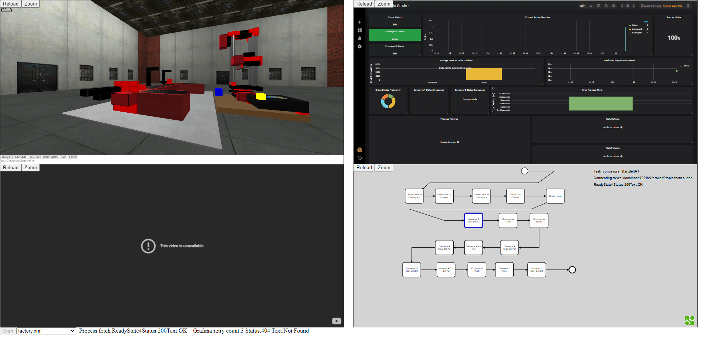
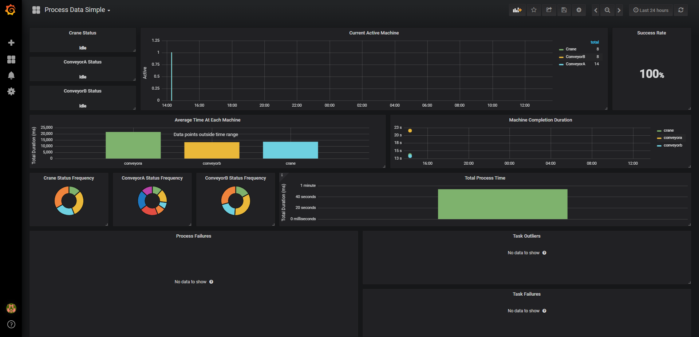
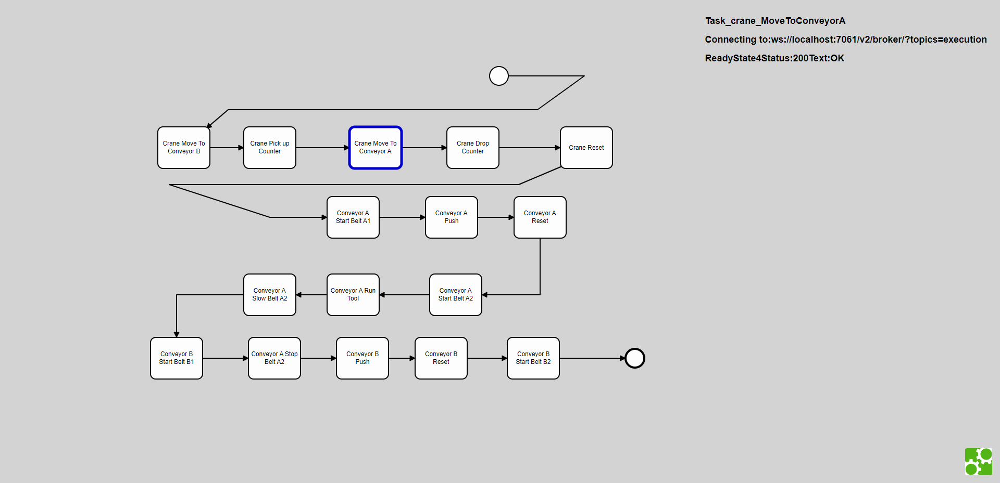

# Introduction

The Digital Twin Development Tool Kit is designed to facilitate the development of digital models, also known as digital twins, of physical entities. These digital twins possess the capability to replicate the physical behavior of their corresponding entities within a digital environment. These digital twins can be stored and shared for the purpose of learning, Traning and experimentation.

The toolkit does not require the user to have a physical model in order to create a digital twin, however, in the context of the iPRODUCE use case, it is likely that a physical model will be utilized.

The digital twins created through the use of this tool can be utilized by OpIS users to develop, design, and deliver learning and training materials utilizing advanced digital technologies.

The utilization of a digital twin enables the simulation of activities on a small scale, allowing for the learning and experimentation to take place without the wastage of resources or damage to equipment. Furthermore, digital twins can execute synthetic scenarios as a part of training and support learning activities.

## Components 

The Digital Twin Development Toolkit is composed of four main components. 

* The 3D Model View, which provides a visual representation of the digital twin in a 3D world. 
* The Grafana Dashboard, which allows for the monitoring and analysis of data related to the digital twin. 
* The BPMN Sequencer, which enables the automation and control of processes within the digital twin
* Live video feed of the corresponding physical machine, allowing for the real-time comparison and correlation of the digital twin with its physical counterpart.

These components work together to provide a comprehensive and efficient tool for the development of digital twins of physical entities.

### The 3D Model (3D world)

")

The initial component of the Digital Twin Development tool kit is the 3D world or the representation of the 3D model. Utilizing this feature, the capability to design and import custom 3D models is provided. Within this component, a comprehensive 360-degree view of the 3D model or 3D world can be obtained, enabling the manipulation of the view through rotation, zooming in and out, and the ability to observe the 3D model from various angles.

### The Grafana Dashboard

The second component of the Digital Twin Development tool kit is a Grafana dashboard, which serves as a visualization and analytics tool utilized to display all analytics pertaining to the selected 3D model. This includes but not limited to, the identification of currently active machines within the process, the calculation of average time per task, and the detection of any failures within the system.

### The BPMN Sequencer

The third component of the Digital Twin Development tool kit is a Business Process Modeling Notation (BPMN) viewer, which is a graphical representation tool that illustrates the various steps involved in a business process. This enables the automation and control of processes within the digital twin. By utilizing BPMN, the arrangement and sequence of processes required for implementation can be effectively organized and managed.

### Live video feed
The fourth component of the Digital Twin Development tool kit is the integration of a video display feature, which provides a real-time visual representation of the physical factory. By connecting the Digital Twin with the factory, this feature allows for the synchronous observation of the movement of physical assets in relation to the corresponding 3D model.